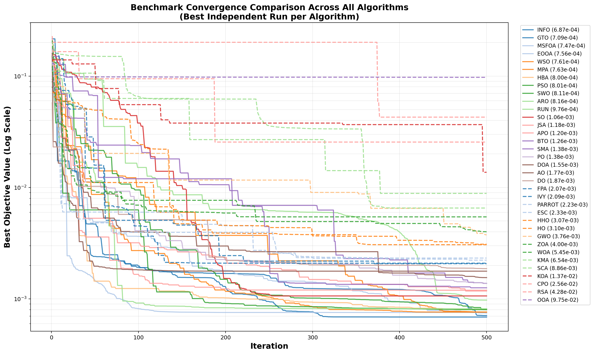
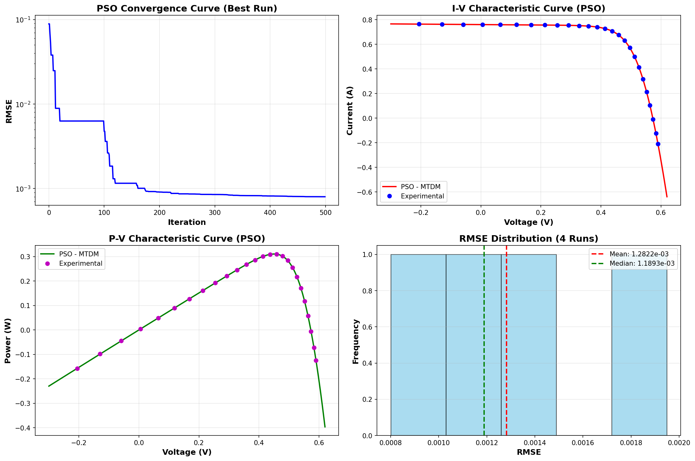

# 🚀 35 Nature-Inspired & Metaheuristic Optimization Algorithms Suite
### *A Multi-Platform Benchmark, Implementation, and Comparative Analysis Library (Python & MATLAB)*

[](https://www.python.org/)
[](https://www.mathworks.com/products/matlab.html)
[](LICENSE)
[](requirements.txt)

---

## 📑 Table of Contents
- [📖 Overview](#-overview)
- [🖼️ Sample Visualizations & Dashboards](#️-sample-visualizations--dashboards)
- [📂 Repository Architecture](#-repository-architecture)
- [📋 Complete Algorithm Catalog (35 Metaheuristics)](#-complete-algorithm-catalog-35-metaheuristics)
- [⚡ Quickstart Guide](#-quickstart-guide)
  - [1. Prerequisites & Installation](#1-prerequisites--installation)
  - [2. Run a Single Algorithm](#2-run-a-single-algorithm)
  - [3. Run a Fast Smoke Test (All 35 Algorithms)](#3-run-a-fast-smoke-test-all-35-algorithms)
  - [4. Run the Full Sequential Benchmark (All 35 Algorithms)](#4-run-the-full-sequential-benchmark-all-35-algorithms)
  - [5. Generate Comparison Leaderboard & Overlaid Plot](#5-generate-comparison-leaderboard--overlaid-plot)
- [📊 Outputs Generated](#-outputs-generated)
  - [1. Styled Excel Workbooks](#1-styled-excel-workbooks-resultsexcel)
  - [2. High-Resolution Visualizations](#2-high-resolution-visualizations-resultsfigures)
- [🛠️ Step-by-Step Guide: How to Plug in Your Custom Benchmark Problem](#️-step-by-step-guide-how-to-plug-in-your-custom-benchmark-problem)
  - [Step 1: Open `algorithms/problem.py`](#step-1-open-algorithmsproblempy)
  - [Step 2: Define Dimension and Search Bounds](#step-2-define-dimension-and-search-bounds)
  - [Step 3: Implement Your Objective Function](#step-3-implement-your-objective-function)
  - [Step 4: Run the Suite](#step-4-run-the-suite)
- [💻 MATLAB Usage](#-matlab-usage)
- [📚 Academic Citation & References](#-academic-citation--references)
- [🤝 Contributing](#-contributing)
- [📄 License](#-license)

---

## 📖 Overview

This repository provides a standardized, research-grade suite of **35 state-of-the-art metaheuristic and nature-inspired optimization algorithms**. Each algorithm is implemented in **Python** (with corresponding **MATLAB** source codes and author archives), complete BibTeX citations, and an automated experiment execution, statistical reporting, and visualization framework.

The framework features:
- **Plug-and-Play Problem Interface**: `problem.py` serves as a modular example benchmark harness. Define your objective function once in `problem.py`, and immediately run any or all 35 algorithms on it.
- **Automated Multi-Run Statistical Harness**: Computes Min (Best), Mean, Median, Max (Worst), Standard Deviation, and Variance over $N$ independent runs.
- **Publication-Ready Visualizations**: Generates multi-panel dashboards, log-scale convergence curves, boxplots, and multi-algorithm overlaid comparison plots (`Comparison_Convergence_All.png`).
- **Styled Multi-Sheet Excel Reports**: Automatically exports professional `.xlsx` workbooks containing complete run logs, iteration histories, and executive statistical summaries, along with the consolidated global comparison leaderboard (`Problem_Results.xlsx`).

---

## 🖼️ Sample Visualizations & Dashboards

The suite automatically generates publication-quality graphics for every run and cross-algorithm comparison:

### 1. Cross-Algorithm Convergence Leaderboard (`Comparison_Convergence_All.png`)
*Overlaid log-scale convergence profiles comparing the best independent run across all 35 algorithms on the benchmark problem:*



### 2. Multi-Panel Performance Dashboard (`{ALGO}_Main.png`)
*Comprehensive dashboard automatically generated for each algorithm (showing Best-Run Convergence, Multi-Run Repeatability, Fitness Distribution Histogram, and Boxplot):*



---

## 📂 Repository Architecture

```text
Algorithms/
├── README.md                      # Comprehensive repository documentation & guide
├── LICENSE                        # MIT License & third-party academic attribution
├── requirements.txt               # Python package dependencies
├── .gitignore                     # Git ignore rules for Python & temp files
├── citations.bib                  # BibTeX references for all 35 original papers
│
├── algorithms/                    # 🐍 PYTHON IMPLEMENTATIONS & RUNNERS
│   ├── problem.py                 # ⭐ Modular benchmark problem harness & experiment engine
│   ├── run_all_algorithms.py      # Master sequential runner for all 35 algorithms
│   ├── compare_algorithms.py      # Summary leaderboard & overlaid convergence plotter
│   │
│   ├── ao.py                      # Artemisinin Optimizer (2024)
│   ├── apo.py                     # Artificial Protozoa Optimizer (2024)
│   ├── aro.py                     # Artificial Rabbits Optimization (2022)
│   ├── bto.py                     # Barrel Theory-Based Optimizer (2025)
│   ├── cpo.py                     # Crested Porcupine Optimizer (2024)
│   ├── do.py                      # Dandelion Optimizer (2022)
│   ├── doa.py                     # Dream Optimization Algorithm (2025)
│   ├── eooa.py                    # Enhanced Osprey Optimization Algorithm (2026)
│   ├── esc.py                     # Escape Optimization Algorithm (2024)
│   ├── fpa.py                     # Flower Pollination Algorithm (2012)
│   ├── gto.py                     # Gorilla Troops Optimizer (2021)
│   ├── gwo.py                     # Grey Wolf Optimizer (2014)
│   ├── hba.py                     # Honey Badger Algorithm (2021)
│   ├── hho.py                     # Harris Hawks Optimization (2019)
│   ├── ho.py                      # Hippopotamus Optimization (2024)
│   ├── info.py                    # Weighted Mean of Vectors (2022)
│   ├── ivy.py                     # Ivy Algorithm (2024)
│   ├── jsa.py                     # Jellyfish Search Algorithm (2021)
│   ├── kma.py                     # Komodo Mlipir Algorithm (2021)
│   ├── koa.py                     # Kepler Optimization Algorithm (2023)
│   ├── mpa.py                     # Marine Predators Algorithm (2020)
│   ├── msfoa.py                   # Modified Starfish Optimization Algorithm (2026)
│   ├── ooa.py                     # Osprey Optimization Algorithm (2023)
│   ├── parrot.py                  # Parrot Optimizer (2024)
│   ├── po.py                      # Puma Optimizer (2024)
│   ├── pso.py                     # Particle Swarm Optimization (1995)
│   ├── rsa.py                     # Reptile Search Algorithm (2022)
│   ├── run.py                     # Runge Kutta Optimization (2021)
│   ├── sca.py                     # Sine Cosine Algorithm (2016)
│   ├── sma.py                     # Slime Mould Algorithm (2020)
│   ├── so.py                      # Snake Optimizer (2022)
│   ├── swo.py                     # Spider Wasp Optimizer (2023)
│   ├── woa.py                     # Whale Optimization Algorithm (2016)
│   ├── wso.py                     # White Shark Optimizer (2022)
│   └── zoa.py                     # Zebra Optimization Algorithm (2022)
│
├── Sources(MATLAB)/               # 🔬 ORIGINAL MATLAB IMPLEMENTATIONS
│   ├── ARO/
│   ├── Artemisinin Optimizer (AO)-2024/
│   ├── Artificial Protozoa Optimizer (APO)/
│   ├── BTO/
│   ├── CPO/
│   ├── Dandelion-Optimizer (DO)/
│   ├── Dream-Optimization-Algorithm (DOA)/
│   ├── Enhanced-Osprey-Optimization-Algorithm (EOOA)/
│   ├── Escape optimization algorithm (ESC)-2024/
│   ├── FPA/
│   ├── GTO/
│   ├── GWO/
│   ├── Harris-Hawks-Optimization-Algorithm (HHO)/
│   ├── HO/
│   ├── honey_badger (HBA)/
│   ├── IVY/
│   ├── JSA/
│   ├── Kepler-Optimization-Algorithm (KOA)/
│   ├── komodo_mlipir(KMA)/
│   ├── Marine-Predators-Algorithm (MPA)/
│   ├── MSFOA/
│   ├── osprey_optimization (OOA)/
│   ├── Parrot Optimizer (Parrot)/
│   ├── PSO/
│   ├── Puma-Optimizer (PO)/
│   ├── Reptile-Search-Algorithm (RSA)/
│   ├── Runge Kutta Optimization (RUN)/
│   ├── sca/
│   ├── Slime mould algorithm (SMA)/
│   ├── Snake Optimizer (SO)/
│   ├── spider_wasp_optimizer/
│   ├── Weighted Mean of Vectors (INFO)-2022/
│   ├── white_shark_optimizer(WSO)/
│   ├── WOA/
│   └── ZOA/
│
├── sources(ZIP)/                  # 📦 ORIGINAL AUTHOR ARCHIVES (.ZIP)
│
└── results/                       # 📊 AUTOMATICALLY GENERATED OUTPUTS
    ├── excel/                     # Individual & summary .xlsx / .csv workbooks
    └── figures/                   # Dashboards, boxplots & overlaid comparison curves
```

---

## 📋 Complete Algorithm Catalog (35 Metaheuristics)

| #   | Acronym    | Algorithm Name                  | Classification / Metaphor                   | Year | Seminal Publication / Authors                          |
| -----| :-----------| :--------------------------------| :--------------------------------------------| :----:| :-------------------------------------------------------|
| 1   | **AO**     | Artemisinin Optimizer           | Medical Therapy / Malaria Dynamics          | 2024 | Yuan et al., *Displays*                                |
| 2   | **APO**    | Artificial Protozoa Optimizer   | Bio / Protozoan Cell Dynamics               | 2024 | Wang et al., *Knowledge-Based Systems*                 |
| 3   | **ARO**    | Artificial Rabbits Optimization | Bio / Survival & Foraging Strategies        | 2022 | Wang et al., *Eng. Appl. of Artificial Intelligence*   |
| 4   | **BTO**    | Barrel Theory-Based Optimizer   | Socio-Physical / Management Analogy         | 2025 | Tran et al., *Appl. Eng. Letters*                      |
| 5   | **CPO**    | Crested Porcupine Optimizer     | Bio / Defensive Protection Behaviors        | 2024 | Abdel-Basset et al., *Knowledge-Based Systems*         |
| 6   | **DO**     | Dandelion Optimizer             | Plant / Wind Seed Dispersal Dynamics        | 2022 | Zhao et al., *Eng. Appl. of Artificial Intelligence*   |
| 7   | **DOA**    | Dream Optimization Algorithm    | Cognitive Science / Human Dreaming          | 2025 | Lang & Gao, *Comp. Meth. in Appl. Mech. & Eng.*        |
| 8   | **EOOA**   | Enhanced Osprey Optimization    | Bio / Evolutionary Avian Foraging           | 2026 | Bouali & Alamri, *Biomimetics*                         |
| 9   | **ESC**    | Escape Optimization Algorithm   | Social Dynamics / Crowd Evacuation          | 2024 | OuYang et al., *Artificial Intelligence Review*        |
| 10  | **FPA**    | Flower Pollination Algorithm    | Plant / Pollination Dynamics & Lévy Flight  | 2012 | Yang, *UCNC 2012 / Springer LNCS*                      |
| 11  | **GTO**    | Gorilla Troops Optimizer        | Swarm / Gorilla Troop Social Hierarchy      | 2021 | Abdollahzadeh et al., *Int. J. of Intelligent Systems* |
| 12  | **GWO**    | Grey Wolf Optimizer             | Swarm / Predatory Hierarchy & Stalking      | 2014 | Mirjalili et al., *Advances in Engineering Software*   |
| 13  | **HBA**    | Honey Badger Algorithm          | Bio / Intelligent Foraging & Digging        | 2022 | Hashim et al., *Math. and Computers in Simulation*     |
| 14  | **HHO**    | Harris Hawks Optimization       | Swarm / Cooperative Surprise Pounce         | 2019 | Heidari et al., *Future Generation Computer Systems*   |
| 15  | **HO**     | Hippopotamus Optimization       | Bio / Amphibious Defense Behaviors          | 2024 | Amiri et al., *Scientific Reports (Nature Portfolio)*  |
| 16  | **INFO**   | Weighted Mean of Vectors        | Mathematics / Vector Mean Operations        | 2022 | Ahmadianfar et al., *Expert Systems with Applications* |
| 17  | **IVY**    | Ivy Algorithm                   | Plant / Climbing & Phototropic Growth       | 2024 | Ghasemi et al., *Knowledge-Based Systems*              |
| 18  | **JSA**    | Jellyfish Search Algorithm      | Marine / Current Following & Bloom Motion   | 2021 | Chou & Truong, *Applied Mathematics and Computation*   |
| 19  | **KMA**    | Komodo Mlipir Algorithm         | Bio / Lizard Hunting & Positional Tracking  | 2021 | Suyanto et al., *Applied Soft Computing*               |
| 20  | **KOA**    | Kepler Optimization Algorithm   | Physical / Keplerian Planetary Mechanics    | 2023 | Abdel-Basset et al., *Knowledge-Based Systems*         |
| 21  | **MPA**    | Marine Predators Algorithm      | Bio / Oceanic Predator Foraging Strategies  | 2020 | Faramarzi et al., *Expert Systems with Applications*   |
| 22  | **MSFOA**  | Modified Starfish Optimization  | Bio / Multi-Arm Regeneration Dynamics       | 2026 | Akbulut, *Expert Systems with Applications*            |
| 23  | **OOA**    | Osprey Optimization Algorithm   | Bio / Avian Fish Hunting Behaviors          | 2023 | Dehghani & Trojovský, *Frontiers in Mech. Eng.*        |
| 24  | **PARROT** | Parrot Optimizer                | Bio / Avian Behavioral Intelligence         | 2024 | Lian et al., *Computers in Biology and Medicine*       |
| 25  | **PO**     | Puma Optimizer                  | Swarm / Solitary Feline Stalking & Pouncing | 2024 | Abdollahzadeh et al., *Cluster Computing*              |
| 26  | **PSO**    | Particle Swarm Optimization     | Swarm Intelligence (Seminal Foundation)     | 1995 | Kennedy & Eberhart, *IEEE ICNN*                        |
| 27  | **RSA**    | Reptile Search Algorithm        | Bio / Crocodilian Encircling & Hunting      | 2022 | Abualigah et al., *Expert Systems with Applications*   |
| 28  | **RUN**    | Runge Kutta Optimization        | Mathematics / Runge-Kutta Slope Dynamics    | 2021 | Ahmadianfar et al., *Expert Systems with Applications* |
| 29  | **SCA**    | Sine Cosine Algorithm           | Mathematics / Trigonometric Search Patterns | 2016 | Mirjalili, *Knowledge-Based Systems*                   |
| 30  | **SMA**    | Slime Mould Algorithm           | Bio / Plasmodium Oscillation Waves          | 2020 | Li et al., *Future Generation Computer Systems*        |
| 31  | **SO**     | Snake Optimizer                 | Bio / Mating, Fighting & Foraging           | 2022 | Hashim & Hussien, *Knowledge-Based Systems*            |
| 32  | **SWO**    | Spider Wasp Optimizer           | Bio / Parasitoid Nesting & Prey Capture     | 2023 | Abdel-Basset et al., *Artificial Intelligence Review*  |
| 33  | **WOA**    | Whale Optimization Algorithm    | Swarm / Bubble-Net Hunting Dynamics         | 2016 | Mirjalili & Lewis, *Advances in Engineering Software*  |
| 34  | **WSO**    | White Shark Optimizer           | Marine / Olfactory Tracking & Ocean Search  | 2022 | Braik et al., *Knowledge-Based Systems*                |
| 35  | **ZOA**    | Zebra Optimization Algorithm    | Swarm / Zebra Defense & Anti-Predation      | 2022 | Trojovská et al., *IEEE Access*                        |

---

## ⚡ Quickstart Guide

### 1. Prerequisites & Installation

Ensure you have **Python 3.8+** installed. Clone the repository and install the dependencies:

```bash
git clone https://github.com/Demas-George/algorithms-for-research.git
cd algorithms-for-research

# (Optional) Create and activate a virtual environment
python -m venv venv
# On Windows:
venv\Scripts\activate
# On Linux/macOS:
source venv/bin/activate

# Install required packages
pip install -r requirements.txt
```

### 2. Run a Single Algorithm

You can run any individual algorithm directly. It will execute independent runs on the configured problem in `problem.py`, print statistics, and save figures and Excel sheets in `results/`:

```bash
# Run Particle Swarm Optimization
python algorithms/pso.py

# Run Grey Wolf Optimizer
python algorithms/gwo.py

# Run Marine Predators Algorithm
python algorithms/mpa.py
```

### 3. Run a Fast Smoke Test (All 35 Algorithms)

Verify your environment by running a fast sanity check (10 search agents, 25 iterations, 2 independent runs per algorithm across all 35 algorithms):

```bash
python algorithms/run_all_algorithms.py --smoke
```

### 4. Run the Full Sequential Benchmark (All 35 Algorithms)

Execute the full statistical benchmark across all 35 algorithms:

```bash
# Default execution (agents=30, iter=500, runs=4)
python algorithms/run_all_algorithms.py

# Custom configurations
python algorithms/run_all_algorithms.py --agents 30 --iter 500 --runs 10
```

### 5. Generate Comparison Leaderboard & Overlaid Plot

To refresh the cross-algorithm leaderboard and regenerate the overlaid convergence plot:

```bash
python algorithms/compare_algorithms.py
```

---

## 📊 Outputs Generated

All experiment artifacts are automatically saved into the `results/` folder:

### 1. Styled Excel Workbooks (`results/excel/`)
- **`Problem_Results.xlsx` & `.csv`**: Consolidated global comparison leaderboard ranking all 35 algorithms strictly by optimization fitness (Min, Mean, Median, Std Dev RMSE).
- **`{ALGO}_Results.xlsx`**: Detailed multi-sheet workbook for each algorithm containing:
  - **`Summary` Sheet**: Complete table of all $N$ independent runs, including Best Fitness, Decision Variable coordinates ($x_1, \dots, x_D$), and markers for `★ BEST` and `✗ WORST` runs.
  - **`Convergence_All` Sheet**: Complete step-by-step convergence history for all $N$ runs over every iteration.
  - **`Statistics` Sheet**: Executive summary including Min, Max, Mean, Median, Std Dev, and Variance.

### 2. High-Resolution Visualizations (`results/figures/`)
- **`Comparison_Convergence_All.png`**: Overlaid log-scale convergence profile comparing the best runs across all 35 algorithms with distinct styling.
- **`{ALGO}_Main.png`**: Comprehensive 2×2 dashboard displaying:
  - `(Top-Left)`: Best Run Convergence curve (log-scale).
  - `(Top-Right)`: Multi-run convergence overlay showing repeatability.
  - `(Bottom-Left)`: Fitness score distribution histogram.
  - `(Bottom-Right)`: Boxplot illustrating variance and distribution.

---

## 🛠️ Step-by-Step Guide: How to Plug in Your Custom Benchmark Problem

The entire benchmark suite is decoupled from any specific problem formulation. `algorithms/problem.py` serves as a modular template and example benchmark.

To test your own benchmark or real-world problem across all 35 algorithms, simply edit **[`algorithms/problem.py`](algorithms/problem.py)**:

### Step 1: Open [`algorithms/problem.py`](algorithms/problem.py)

Locate the problem dimension, bounds, and objective function definition.

### Step 2: Define Dimension and Search Bounds

Set the dimensionality `dim` (number of decision variables) and search boundaries `lb` and `ub`:

```python
# Set number of variables:
dim = 10

# Set lower and upper bounds (scalar or NumPy array of shape (dim,)):
lb = np.array([0.0, 0.0, 0.0, 0.0, 0.0, 0.0, 1.0, 1.0, 1.0, 0.0])
ub = np.array([1.0, 1e-6, 1e-6, 1e-6, 0.5, 100.0, 2.0, 2.0, 2.0, 0.5])
```

### Step 3: Implement Your Objective Function

Define `objective_function(x)`. It receives a 1D NumPy array `x` of length `dim` and returns a scalar `float` fitness score:

```python
def objective_function(x):
    """
    Custom objective function to be MINIMIZED.
    x : 1D numpy.ndarray of shape (dim,)
    returns: scalar float
    """
    x = np.asarray(x, dtype=np.float64)
    
    # Calculate your model, simulation, or mathematical function
    fitness = np.sum(x**2)
    
    return float(fitness)
```

> **Note**: Optimization algorithms in this repository minimize the objective function. If your problem is a maximization task, simply return `-score`.

### Step 4: Run the Suite!

Once you save `problem.py`, all 35 algorithms automatically execute on your problem:

```bash
python algorithms/run_all_algorithms.py
```

---

## 💻 MATLAB Usage

To inspect or run algorithms in MATLAB:
1. Open MATLAB and navigate to `Sources(MATLAB)/` or `Sources(MATLAB)/new algorithms/`.
2. Enter the subfolder of the desired algorithm.
3. Open the primary `.m` script (typically `main.m` or `{Algorithm}.m`).
4. Execute the script to view native MATLAB convergence plots and console outputs.

---

## 📚 Academic Citation & References

All algorithms included in this suite are credited to their original authors. If you use this repository or any algorithm implementations in academic research, please cite the corresponding seminal papers provided in [`citations.bib`](citations.bib).

Example BibTeX citation:
```bibtex
@article{Mirjalili2014GWO,
  title={Grey Wolf Optimizer},
  author={Mirjalili, Seyedali and Mirjalili, Seyed Mohammad and Lewis, Andrew},
  journal={Advances in Engineering Software},
  volume={69},
  pages={46--61},
  year={2014},
  publisher={Elsevier},
  doi={10.1016/j.advengsoft.2013.12.007}
}
```
*(See [`citations.bib`](citations.bib) for the complete list of all 35 citations)*.

---

## 🤝 Contributing

Contributions are welcome! To add a new metaheuristic algorithm:
1. Fork this repository.
2. Implement your optimizer following the standard signature:
   `algo(n_agents, max_iter, lb, ub, dim, fobj) -> (best_score, best_pos, convergence_curve)`
3. Add the algorithm import and adapter in `algorithms/run_all_algorithms.py`.
4. Add the seminal paper citation to `citations.bib`.
5. Submit a Pull Request.

---

## 📄 License

This project is licensed under the [MIT License](LICENSE).

Original MATLAB source codes and archives located in `Sources(MATLAB)/` and `sources(ZIP)/` remain the intellectual property of their respective original authors as cited in [`citations.bib`](citations.bib) and are included strictly for academic verification, benchmarking, and educational purposes.
